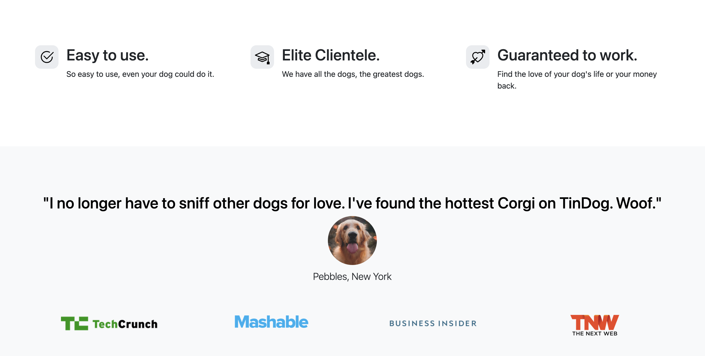

# Tindog Project
The front-end design of TinDog's homepage website is where users first land combine HTML, Python, and Bootstrap to create an engaging and inviting environment for people who are dog lovers and help them find canine companions for their furry friends.

**Elements of TinDog's Home Page Front-End Design**

- **Header Section:** At the top of the home page that typically includes iOS and Android button downloads.

 

- **Features and Testimonials:** Below this section, TinDog may highlight key features or benefits of the platform and include a sample of user testimonials to build trust and credibility.

 

- **Footer Section:** The footer typically contains links to important pages.

 

## Prerequisites
- Python - version 3.11.1
- Bootstrap-Flask - version 5.3.2

## Executing Output
Clone this repo to your desktop and open `index.html` file on Pycharm or VScode.

## Inspiration
This project was inspired by Tinder Application.